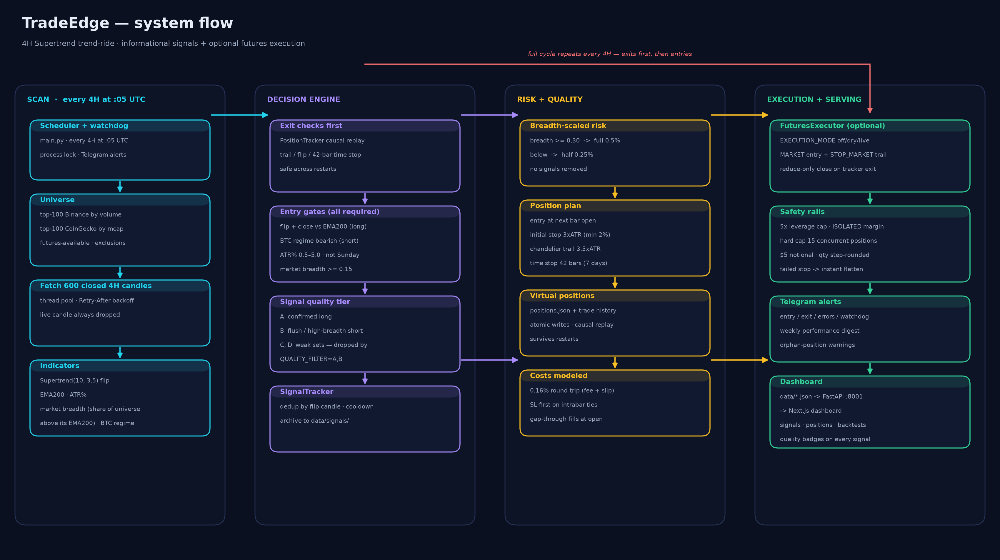
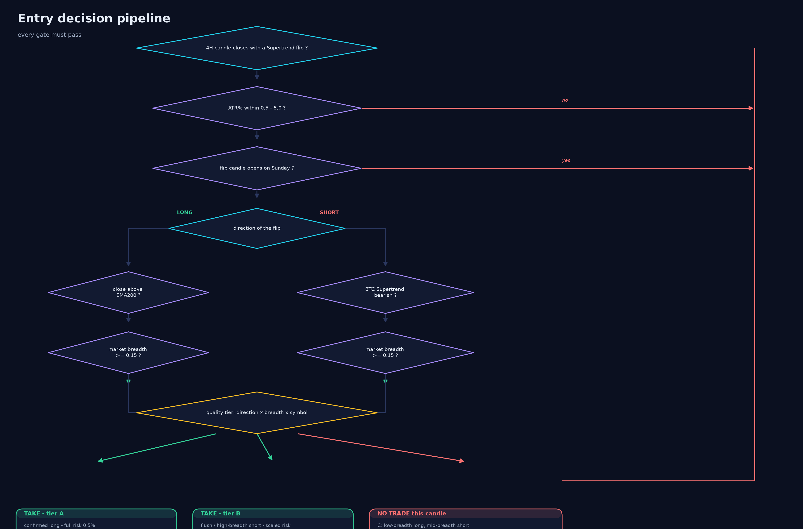
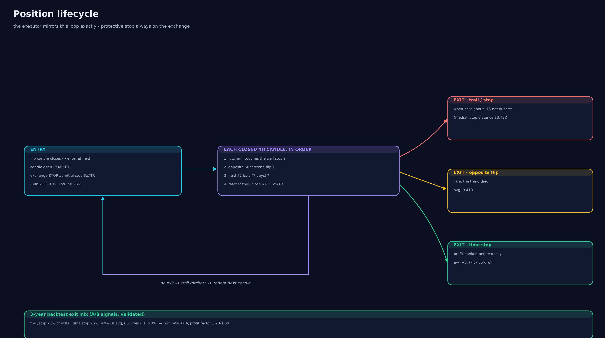

# 🤖 TradeEdge — Crypto Signal Bot & Dashboard

Automated cryptocurrency signal scanner. Scans the top 100 Binance USDT pairs by 24h volume and top 100 by CoinGecko market cap for **4H Supertrend trend-ride entries**, filtered by EMA200 trend direction and market breadth. Each signal is managed with a 3×ATR initial stop, 3.5×ATR trailing stop, and 42-bar time stop. Alerts go to Telegram; a Next.js dashboard shows everything live.

> **⚠️ Not financial advice.** This is research/educational software that
> generates *informational* signals and virtual (paper) trades. Futures
> trading with leverage can liquidate your entire account. Past backtest
> performance — including the numbers in [`backtest/REPORT.md`](backtest/REPORT.md)
> — does not guarantee future results. Use at your own risk. (The full
> research report and methodology live in the author's private notes.)

**Requirements:** Python 3.10+ (uses `X | Y` type hints), Node.js 18+ for the
dashboard. All exchange interaction uses public Binance endpoints by default;
live execution is off unless explicitly enabled (`EXECUTION_MODE`).

---

## 🧠 How It Works

### System architecture

<p align="center">
  
</p>

### Entry decision pipeline

<p align="center">
  
</p>

### Position lifecycle

<p align="center">
  
</p>

Risk sizing is an overlay on both directions: **full risk (0.5%)** when market
breadth ≥ 0.30, **half risk (0.25%)** below it. Costs are modeled at 0.16%
round trip. The full research methodology, walk-forward folds and the
experiment ledger are documented in `backtest/`.

---

## 📡 Signal Definition

A signal fires on the **confirmed** 4H candle when **all** of these are true:

| Direction | Supertrend flip | EMA filter | Breadth | ATR% range |
|-----------|----------------|-----------|---------|------------|
| **BUY** | bearish → bullish | price > EMA200 | ≥ 0.30 | 0.5% – 5.0% |
| **SELL** | bullish → bearish | BTC Supertrend bearish | ≥ 0.30 | 0.5% – 5.0% |

### Position Plan (per signal)

For a BUY (SELL mirrored):
- `entry` = current close
- `initial_stop` = entry − 3 × ATR
- `risk_pct` = breadth-scaled (full 0.5% or half 0.25%)
- `trail` = 3.5 × ATR chandelier that ratchets from the initial stop as closes advance
- `time_stop` = 42 bars (≈ 7 days)

---

## 📊 Strategy Configuration

| Indicator | Settings | Role |
|-----------|----------|------|
| Supertrend | ATR 10, multiplier 3.5 | Flip trigger |
| EMA 200 | — | Trend filter (longs); BTC-regime gate (shorts) |
| Market breadth | ≥ 30% above 200MA | Risk-size scaler |
| ATR % | 0.5% – 5.0% of price | Volatility filter |
| Initial stop | 3 × ATR | Max loss per trade |
| Trailing stop | 3.5 × ATR | Lock gains |
| Time stop | 42 bars | Hard exit ceiling |

- **Timeframe:** 4H
- **Universe:** Top 100 by 24h quote volume + Top 100 by CoinGecko market cap (merged, deduped)
- **Cooldown:** 4 hours per (symbol, direction)
- **Scan cadence:** hourly at :05 (overlap-safe; dedup suppresses repeats)
- **Max open positions:** 10

---

## ⚙️ Setup

### 1. Install Python dependencies
```bash
pip install -r requirements.txt
```

### 2. Install frontend dependencies
```bash
cd frontend
npm install
```

### 3. Create Telegram Bot
1. Open Telegram → search **@BotFather**
2. Send `/newbot` → follow instructions → copy the **token**
3. Start a chat with your bot
4. Get your chat ID: visit `https://api.telegram.org/bot<YOUR_TOKEN>/getUpdates`

### 4. Configure .env
```bash
cp .env.example .env
```
Edit `.env`:
```
TELEGRAM_BOT_TOKEN=1234567890:ABCdefGHIjklMNOpqrSTUvwxYZ
TELEGRAM_CHAT_ID=123456789

# CoinGecko (optional — raises rate limits)
COINGECKO_API_KEY=

# Supertrend strategy (4H)
SUPERTREND_ATR_PERIOD=10
SUPERTREND_MULTIPLIER=3.5
EMA_FILTER_PERIOD=200
TRAIL_ATR_MULT=3.5
INITIAL_STOP_ATR_MULT=3.0
TIME_STOP_BARS=42
BREADTH_THRESHOLD=0.3
ATR_MIN_PCT=0.5
ATR_MAX_PCT=5.0
SCAN_TIMEFRAME=4h
CANDLE_FETCH_LIMIT=600
SIGNAL_COOLDOWN_HOURS=4
```

### 5. Run the bot
```bash
python main.py
```
This starts:
- Scanner scheduler (4H scan every hour at :05) + watchdog thread
- FastAPI backend server on `http://localhost:8001`

### 6. Run the frontend
```bash
cd frontend && npm run dev
```
Frontend at `http://localhost:3000`.

---

## 📁 File Structure

```
D:\projects\trading\4H-1H-Trading-Algo\
├── main.py                    # Bot entry: scheduler + watchdog + API lifecycle
├── api_server.py              # FastAPI REST API (mtime cache, health, pagination)
├── scanner.py                 # Binance + CoinGecko + Supertrend + EMA + breadth
├── position_tracker.py        # Virtual position management (trail, time, flip exits)
├── signal_tracker.py          # Signal persistence & dedup
├── telegram_bot.py            # Signal, error, orphan + weekly digest
├── config.py                  # Settings management (.env)
├── signals.json               # Signal database (live)
├── data/
│   ├── signals/               # Weekly archives by year/month/week
│   ├── trades.json            # Closed virtual trade log
│   └── positions.json         # Open virtual positions
└── frontend/                  # Next.js dashboard
    ├── src/
    │   ├── app/
    │   │   ├── dashboard/page.tsx
    │   │   ├── signals/page.tsx
    │   │   └── status/page.tsx
    │   └── lib/
    │       ├── api.ts
    │       └── utils.ts
    └── next.config.ts
```

---

## ⏰ Schedule

- **Every hour at :05** → 4H Supertrend scan (overlap-safe; dedup suppresses repeats within the 4h cooldown)
- **Startup** → one immediate 4H scan
- **Mondays 09:00 UTC** → weekly Telegram digest (win rate, avg R, profit factor)
- **Every 15 min** → position tracker update (trailing stop, time stop, flip exits)

---

## 🖥️ Dashboard Pages

| Page | Route | Description |
|------|-------|-------------|
| **Dashboard** | `/dashboard` | Stat cards (total / 24h / buy / sell), hourly bar chart, buy-vs-sell pie, recent signals |
| **Signals** | `/signals` | Filterable table: symbol, direction, entry, SL, Risk %, ATR%, source, timestamp |
| **Status** | `/status` | Scanner heartbeat (scan freshness) + open virtual positions |

All pages auto-refresh every 30 seconds.

---

## 🔧 Customization

Edit `.env` to adjust:
- `TOP_N_COINS` — how many coins per universe (default: 100)
- `MAX_SIGNALS_PER_SCAN` — max alerts per scan (default: 20)
- `COINGECKO_API_KEY` — optional CoinGecko demo API key for higher rate limits
- `SUPERTREND_ATR_PERIOD` / `SUPERTREND_MULTIPLIER` — Supertrend params (default: 10 / 3.5)
- `EMA_FILTER_PERIOD` — trend filter EMA (default: 200)
- `ATR_MIN_PCT` / `ATR_MAX_PCT` — volatility band (default: 0.5 / 5.0)
- `TRAIL_ATR_MULT` — trailing stop distance in ATR multiples (default: 3.5)
- `INITIAL_STOP_ATR_MULT` — initial stop distance in ATR multiples (set: 3.0)
- `TIME_STOP_BARS` — hard exit ceiling (default: 42 bars ≈ 7 days)
- `BREADTH_THRESHOLD` — min breadth to use full risk size (default: 0.30)
- `BREADTH_GATE` — no entries at all below this breadth floor (default: 0.15)
- `SKIP_SUNDAY_ENTRIES` — skip flip candles opening on Sunday (default: true)
- `MAX_OPEN_POSITIONS` — portfolio cap (default: 10)
- `RISK_PCT_FULL` / `RISK_PCT_HALF` — per-trade risk by regime (set: 0.5% / 0.25%; halved after 3-year drawdown validation)
- `EXECUTION_MODE` — off / dry / live futures execution (see SYSTEM_DOCUMENTATION §7b; dry by default, leverage capped at 5x, isolated margin, `EXECUTION_MAX_POSITIONS=15`)
- `EXECUTION_SIZING` — auto (0.5%/0.25% of equity risk once the account can express it, fixed margin below) / percent / fixed
- `SIGNAL_COOLDOWN_HOURS` — dedup window (default: 4)

---

## 📚 Documentation

- **`AI_CONTEXT.md`** — full architecture, data models, API reference (read this first)
- **`CLAUDE.md`** — agent rules and dev workflow
- **`SYSTEM_DOCUMENTATION.md`** — system overview and component reference
- **`DESIGN.md`** — visual design system
- **`PRODUCT.md`** — product positioning

---

## ⚠️ Disclaimer

This bot is for informational purposes only. Not financial advice. Always do your own research and manage your risk.

---

## 📄 License

[MIT](LICENSE) — © 2026 Sabbir Hossain. Signals are informational; you are
responsible for anything you trade.
